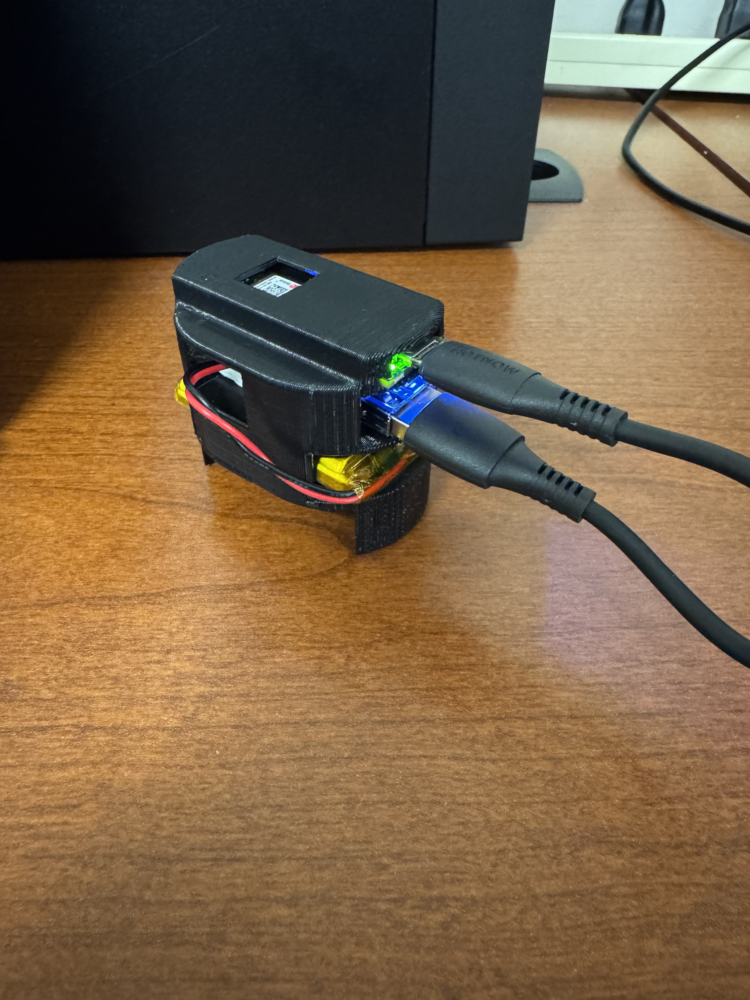
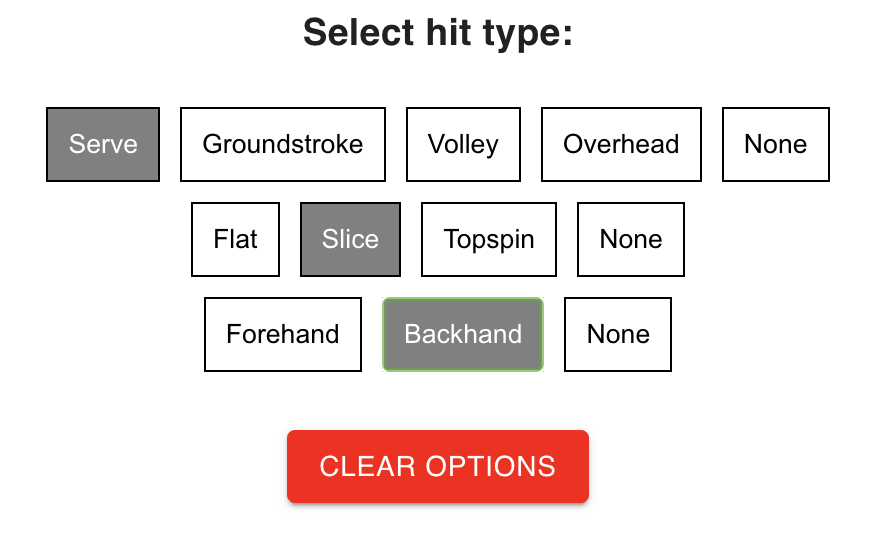
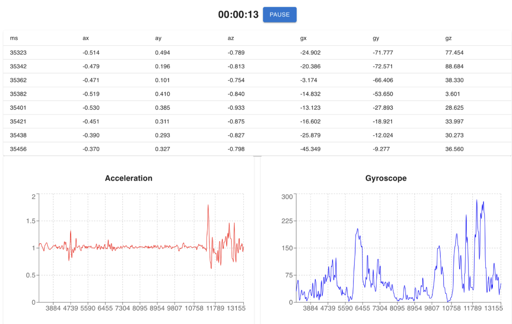

# CSE 60685 Design Project - Smart Sports Sensor

## Requirements

### Hardware

1. [Arduino Nano 33 BLE Rev2]

### Software

1. [Arduino IDE 2] ([source](https://github.com/arduino/arduino-ide))

### Arduino Core

1. [ArduinoCore-mbed] ([source](https://github.com/arduino/ArduinoCore-mbed))

### Libraries

1. [Arduino_BMI270_BMM150] ([source](https://github.com/arduino-libraries/Arduino_BMI270_BMM150))
1. [ArduinoBLE] ([source](https://github.com/arduino-libraries/ArduinoBLE))
1. [MicroTFLite] ([source](https://github.com/johnosbb/MicroTFLite))

[Arduino Nano 33 BLE Rev2]: https://docs.arduino.cc/hardware/nano-33-ble-rev2/
[Arduino IDE 2]: https://docs.arduino.cc/software/ide/
[ArduinoCore-mbed]: https://docs.arduino.cc/software/ide-v1/tutorials/getting-started/cores/arduino-mbed_nano/
[Arduino_BMI270_BMM150]: https://docs.arduino.cc/libraries/arduino_bmi270_bmm150/
[ArduinoBLE]: https://docs.arduino.cc/libraries/arduinoble/
[MicroTFLite]: https://docs.arduino.cc/libraries/microtflite/

## Hardware connection

1. Ensure that the arduino is:
- Connected to a battery (Blue light is on)
- Securely mounted to the racquet

## Website application (https://porubcinj.github.io/SmartSportsSensor/#/) 
1. Can clone repository or just follow website above (and skip to step 8).
2. Clone the repository 
3. Ensure you have software / hardware for arduino installed on your device (listed above) 
4. Follow directory to the "website" folder 
5. Install dependencies with "npm install" followed by "npm run dev"
6. Run command npm run dev
7. Follow link to localhost
8. Power on your arduino, blinking blue light indicates its waiting to be connected to bluetooth
9. Scan for device on the website and connect to arduino 

## Data Collection 
- Click Data Collection 
- Select hit hypes, application allows for one selection per row of shot type

- Begin data collection, ensure its working through the live gyroscope and acceleration graphs
- You may pause collection, change shot types, clear options at any point during collection, keep in mind that live reading collects acceleration (x,y,z axis) gyroscope rotations (x,y,z axis) and also shot type even if nothing is selected

- You can restart data collection at any point
- Download the csv of the read data and ensure that it worked properly
  

## TODO: Need directions for training model, live inference, more photos of collection!

